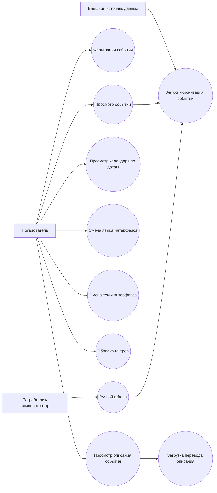
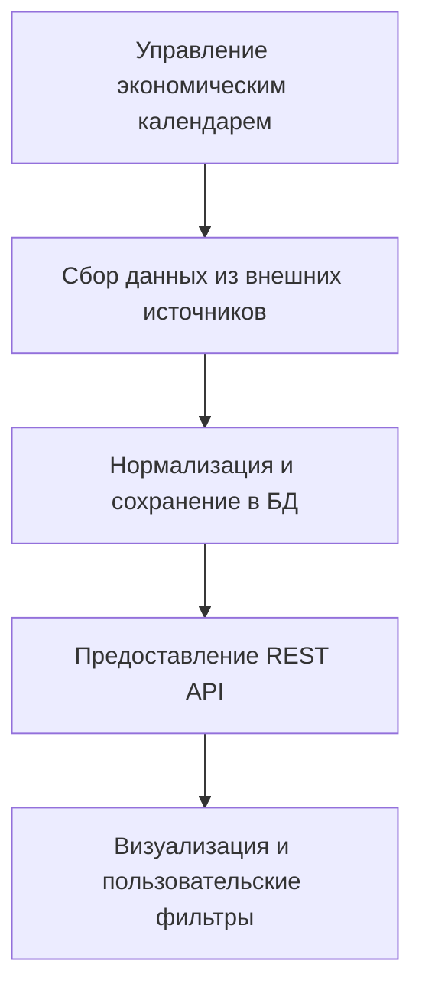
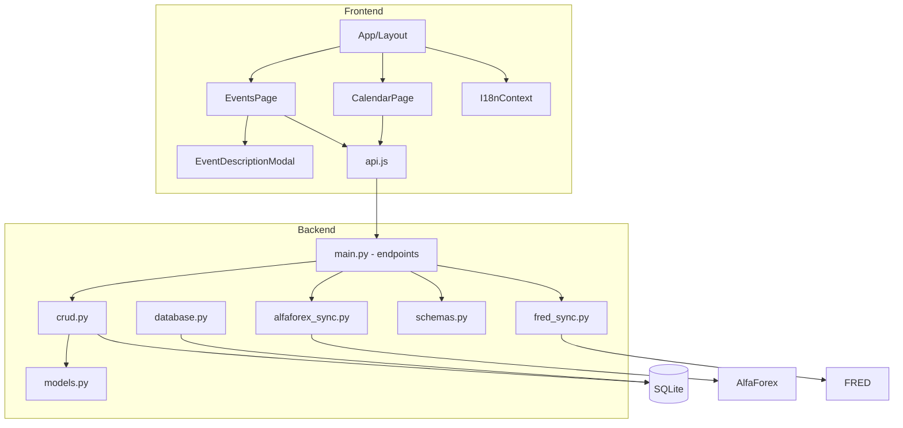
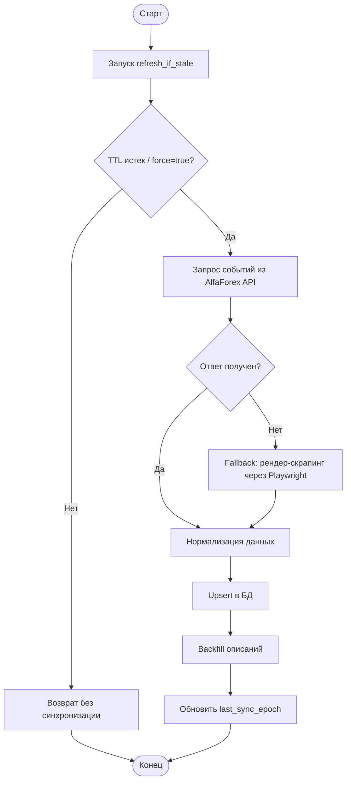
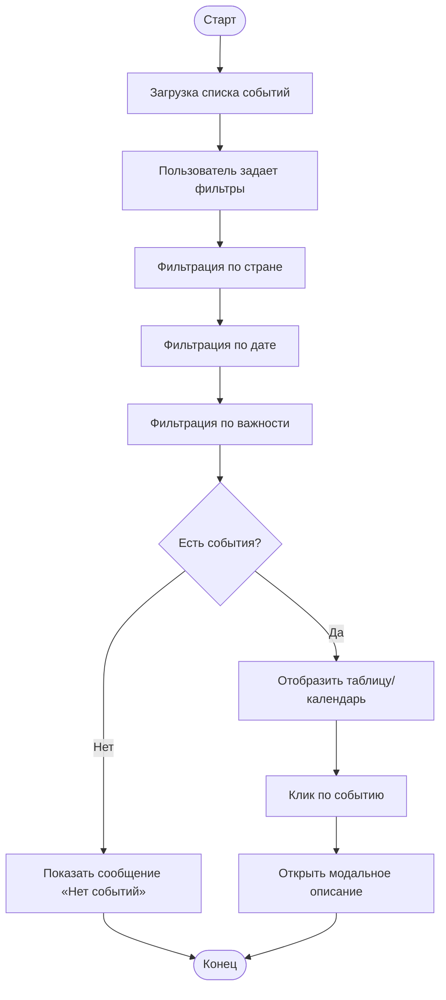

# Курсовая работа  
## Разработка веб-приложения «Экономический календарь» для автоматизации мониторинга макроэкономических событий

---

## Оглавление

1. [Введение](#введение)  
2. [Глава 1. Теоретические основы и анализ проблемы](#глава-1-теоретические-основы-и-анализ-проблемы)  
3. [Глава 2. Предпроектная часть](#глава-2-предпроектная-часть)  
4. [Глава 3. Реализация системы](#глава-3-реализация-системы)  
5. [Заключение](#заключение)  
6. [Список использованных источников](#список-использованных-источников)  
7. [Приложения](#приложения)  

---

## Введение

### Актуальность темы

Актуальность темы исследования обусловлена необходимостью создания надежного программного решения для автоматизации процесса мониторинга и анализа экономических событий, влияющих на финансовые рынки. В условиях высокой волатильности валютного и фондового сегментов участникам рынка требуется оперативный доступ к актуальной информации: датам публикации индикаторов, уровню важности событий, фактическим/прогнозным значениям и поясняющим описаниям.

Традиционные подходы (ручной сбор данных из разрозненных источников, ведение таблиц, фрагментарное использование внешних календарей) приводят к ряду проблем: потере времени, риску ошибок при копировании, задержкам в принятии решений, несогласованности форматов данных. Разработка специализированного веб-приложения позволяет централизовать данные, обеспечить автоматическое обновление, реализовать единые механизмы фильтрации и повысить качество аналитической подготовки.

Практическая ценность разработки особенно заметна в следующих сферах:
- оперативная аналитика и поддержка трейдинговых решений;
- учебные и исследовательские задачи по макроэкономике и финансовым рынкам;
- информационное сопровождение внутри команд (аналитики, риск-менеджеры, преподаватели, студенты).

Следовательно, разработка приложения «Экономический календарь» является актуальной задачей цифровизации информационных процессов в предметной области финансовой аналитики.

### Объект и предмет исследования

**Объектом исследования** является процесс управления и представления данных о макроэкономических событиях в информационных системах финансово-аналитического профиля.  

**Предметом исследования** является разработка программного модуля (веб-приложения) для автоматизированного сбора, хранения, фильтрации и визуализации данных экономического календаря с поддержкой мультиязычного пользовательского интерфейса.

### Цель и задачи курсовой работы

**Целью курсовой работы** является создание и обоснование программного решения для автоматизации работы с экономическим календарем, обеспечивающего удобный доступ к структурированной информации о событиях и их параметрах.

Для достижения цели поставлены следующие задачи:
1. Исследовать предметную область и выявить ключевые проблемы существующих подходов к работе с экономическими событиями.
2. Провести обзор существующих методов и программных решений.
3. Обосновать выбор архитектурного подхода и технологического стека.
4. Выполнить предпроектное моделирование системы (Use Case, IDEF0, DFD, функциональная схема).
5. Сформировать функциональные и нефункциональные требования к модулю.
6. Реализовать серверную и клиентскую части приложения.
7. Проверить работоспособность реализованных сценариев и оценить соответствие требованиям.

### Практическая значимость

Практическая значимость работы заключается в создании прикладного веб-модуля, который может использоваться как в учебной среде, так и в прикладной аналитике для:
- сокращения времени поиска и сопоставления данных о событиях;
- повышения точности за счет унификации форматов хранения;
- автоматизации обновления данных из внешних источников;
- улучшения интерпретации событий благодаря отображению важности, метрик и описаний;
- поддержки пользователей из разных языковых сред (RU/EN/ZH/ES интерфейс).

### Теоретико-методологическая база

Теоретико-методологическую базу работы составили:
- исследования и публикации в области проектирования информационных систем, клиент-серверной архитектуры и баз данных;
- практики разработки веб-приложений с использованием FastAPI, React и SQLAlchemy;
- подходы функционального моделирования (IDEF0), моделирования потоков данных (DFD), сценарного анализа (Use Case);
- стандарты качества программного обеспечения (ISO/IEC 25010) и нормативные документы по проектированию автоматизированных систем.

### Методы исследования

В работе использованы следующие методы:
- анализ предметной области и требований пользователей;
- сравнительный анализ существующих решений;
- функциональное и структурное моделирование;
- проектирование архитектуры и модели данных;
- прототипирование интерфейса;
- модульная и интеграционная проверка сценариев;
- качественная оценка результатов реализации.

### Структура работы

Курсовая работа состоит из введения, трех глав, заключения, списка использованных источников и приложений.

- В **первой главе** рассматриваются теоретические основы и анализ проблемы автоматизации экономического календаря.
- Во **второй главе** приводится предпроектная часть: диаграммы, функциональная модель, требования и обоснование выбора технологического стека.
- В **третьей главе** описывается архитектура приложения, ключевые этапы программной реализации и сценарии пользовательской работы.
- В **заключении** подводятся итоги и определяются направления дальнейшего развития системы.

---

## Глава 1. Теоретические основы и анализ проблемы

### 1.1 Описание предметной области и постановка проблемы

Экономический календарь представляет собой структурированный набор событий, способных повлиять на макроэкономические показатели и динамику финансовых рынков. К таким событиям относятся:
- решения центральных банков по процентным ставкам;
- публикации индексов инфляции и занятости;
- статистические отчеты по ВВП, промышленности, торговому балансу;
- публичные выступления представителей регуляторов.

Для каждого события важны дата, время, страна/регион, уровень влияния (важность), а также количественные показатели (фактическое, прогнозное, предыдущее значения). На практике аналитик должен быстро отвечать на вопросы: «какие события сегодня критичны?», «как менялись ожидания?», «какие страны/валюты затронуты?».

Проблема заключается в том, что данные часто разрознены и представлены в различных форматах. При ручной обработке возникают:
- дублирование информации;
- несвоевременное обновление;
- неполнота данных;
- высокая зависимость от человеческого фактора.

Таким образом, требуется система, которая автоматически получает события, сохраняет их в унифицированной структуре и предоставляет инструменты просмотра/фильтрации в удобном интерфейсе.

### 1.2 Обзор существующих методов и решений, выбор подхода

В рамках анализа можно выделить несколько классов решений:

1. **Готовые веб-календари** (финансовые порталы):  
   + высокая наполненность данных;  
   − ограниченная кастомизация, зависимость от внешнего интерфейса и условий доступа.

2. **Табличные инструменты (Excel/Google Sheets)**:  
   + гибкость ручной настройки;  
   − отсутствие устойчивой автоматизации и единых API-механизмов.

3. **Корпоративные терминалы и коммерческие платформы**:  
   + продвинутая аналитика;  
   − высокая стоимость и избыточность для учебных/локальных задач.

4. **Собственное специализированное веб-приложение**:  
   + полный контроль над бизнес-логикой, источниками и интерфейсом;  
   + возможность расширения под конкретные требования;  
   − необходимость проектирования и сопровождения.

Для курсового проекта выбран четвертый подход, так как он позволяет:
- реализовать строго заданные пользовательские сценарии;
- обеспечить интеграцию данных из нескольких источников (AlfaForex, FRED, локальная БД);
- внедрить кастомные фильтры и мультиязычность;
- продемонстрировать полный цикл инженерной разработки (анализ -> проектирование -> реализация -> проверка).

Технологически целесообразна клиент-серверная архитектура:
- **Backend** на FastAPI: REST API, синхронизация внешних данных, валидация и хранение;
- **Frontend** на React: интерактивная визуализация, фильтрация, маршрутизация, локализация;
- **SQLite + SQLAlchemy**: простота развёртывания и надежное хранение для учебно-прикладного сценария.

### 1.3 Выводы по главе 1

По итогам теоретического анализа установлено:
1. Автоматизация работы с экономическими событиями является актуальной практической задачей.
2. Существующие альтернативы не обеспечивают одновременно гибкость, прозрачность и адаптируемость под конкретные требования курсового проекта.
3. Наиболее обоснованным является разработка собственного веб-приложения на основе клиент-серверной архитектуры.
4. Для дальнейшего проектирования необходимо формализовать процессы через диаграммы и определить требования к модулю.

---

## Глава 2. Предпроектная часть

### 2.1 Диаграмма вариантов использования (Use Case)

Ключевые акторы системы:
- **Пользователь** (аналитик, студент, преподаватель);
- **Внешний источник данных** (API/страница экономического календаря);
- **Администратор/разработчик** (поддержка и настройка системы).

Основные сценарии:
- просмотр списка событий;
- фильтрация по стране, дате, важности;
- просмотр детального описания события;
- переключение языка и темы интерфейса;
- принудительное обновление данных из внешнего источника.



### 2.2 IDEF0 — функциональная модель

Контекстная функция A0: **«Управление экономическим календарем»**.

#### ICOM-модель A0

- **Input (Входы):**
  - данные внешних источников (AlfaForex API/HTML, FRED API);
  - пользовательские параметры фильтрации.
- **Control (Управление):**
  - бизнес-правила системы;
  - требования к формату и валидности данных;
  - расписание/TTL автообновления.
- **Output (Выходы):**
  - актуальный список событий;
  - детальные описания событий;
  - визуальные представления (таблица, календарь).
- **Mechanism (Механизмы):**
  - FastAPI, SQLAlchemy, SQLite, React, Vite;
  - HTTP-запросы, Playwright, клиентский JavaScript.

#### Декомпозиция A0



Краткая интерпретация:
- **A1** отвечает за получение сырых данных;
- **A2** приводит структуру к единому формату (дата, важность, источник, метрики);
- **A3** предоставляет интерфейс взаимодействия клиенту;
- **A4** обеспечивает удобный пользовательский доступ и навигацию.

### 2.3 DFD — диаграмма потоков данных

```mermaid
flowchart LR
    E1[Пользователь] -->|Запрос фильтра/просмотр| P1[Frontend React]
    P1 -->|HTTP GET /events| P2[Backend FastAPI]
    P2 -->|SELECT/UPDATE| D1[(SQLite events.db)]
    P2 -->|JSON список событий| P1
    P1 -->|Отображение таблицы/календаря| E1

    P1 -->|GET /events/{id}/description| P2
    P2 -->|При необходимости запрос перевода| E2[AlfaForex API]
    E2 -->|Описание события| P2
    P2 -->|Описание| P1

    P2 -->|POST /events/refresh| E2
    E2 -->|Пакет событий| P2
    P2 -->|Upsert| D1
```

### 2.4 Функциональная схема модуля



### 2.5 Выбор технологического стека

Выбор стека основан на требованиях учебно-прикладного проекта: скорость разработки, прозрачность кода, доступность документации, простота локального запуска.

1. **FastAPI (Python)**  
   - высокая скорость разработки REST API;  
   - встроенная валидация через Pydantic;  
   - автогенерация OpenAPI/Swagger.

2. **SQLAlchemy + SQLite**  
   - ORM-уровень для типобезопасной работы с данными;  
   - SQLite как легковесная БД без сложной инфраструктуры;  
   - удобство миграции учебного проекта к PostgreSQL при масштабировании.

3. **React + Vite**  
   - компонентный подход к UI;  
   - высокая интерактивность (фильтры, модальные окна, автоперезагрузка);  
   - быстрая сборка и разработка.

4. **Playwright / HTTP-клиенты**  
   - устойчивое извлечение данных при различии форматов внешних источников;  
   - fallback-сценарии при частичной недоступности API.

5. **Мультиязычный слой (I18nContext)**  
   - расширяемость интерфейса для разных языков;  
   - единый словарь строк с fallback-механизмом.

### 2.6 Формирование требований к программному модулю

#### 2.6.1 Функциональные требования

1. Система должна загружать и хранить события экономического календаря.
2. Система должна предоставлять REST API для получения событий.
3. Система должна поддерживать фильтрацию по стране, важности и дате.
4. Система должна обеспечивать ручное и автоматическое обновление данных.
5. Система должна отображать детальное описание выбранного события.
6. Система должна поддерживать отображение событий в виде таблицы и календаря.
7. Система должна поддерживать мультиязычный интерфейс.
8. Система должна сохранять пользовательские настройки (например, язык и тему).

#### 2.6.2 Нефункциональные требования

1. **Надежность:** отказ внешнего источника не должен приводить к полной недоступности интерфейса.
2. **Производительность:** отклик на базовые API-запросы должен быть достаточным для интерактивной работы.
3. **Масштабируемость:** архитектура должна допускать подключение новых источников данных.
4. **Сопровождаемость:** код должен быть модульным и читаемым.
5. **Удобство использования:** UI должен быть понятным и обеспечивать быстрый доступ к нужным событиям.
6. **Портируемость:** проект должен запускаться в типовой среде разработки без сложной инфраструктуры.

### 2.7 Выводы по главе 2

В предпроектной части:
- формализованы пользовательские и системные сценарии (Use Case);
- построена функциональная модель (IDEF0) и модель потоков данных (DFD);
- определена функциональная структура приложения;
- обоснован выбор стека и сформирован полный набор требований.

Полученные результаты создают достаточную основу для реализации системы с контролируемыми свойствами качества.

---

## Глава 3. Реализация системы

### 3.1 Архитектура и логика работы модуля

Реализованное приложение имеет двухуровневую архитектуру:
- **клиентский уровень** (React SPA);
- **серверный уровень** (FastAPI + SQLite).

#### 3.1.1 Серверная часть

Серверная часть организована по модульному принципу:
- `main.py` — точка входа, REST-эндпоинты, CORS, жизненный цикл;
- `models.py` — ORM-модель `Event`;
- `schemas.py` — Pydantic-схемы валидации;
- `crud.py` — операции выборки/создания/upsert;
- `alfaforex_sync.py` — синхронизация и нормализация данных AlfaForex;
- `fred_sync.py` — интеграция с API FRED;
- `database.py` — подключение к БД и служебные операции.

Ключевая логика:
1. При старте приложения создаются таблицы и выполняется первичная инициализация (`seed_if_empty`).
2. Сервис пытается обновить локальную БД данными внешнего источника.
3. При обращении к `/events` клиент получает актуальный срез с учетом фильтров.
4. При запросе описания события доступен fallback: локальное описание -> запрос перевода для внешнего источника.

#### 3.1.2 Клиентская часть

Клиентская часть включает:
- `App.jsx` — маршрутизацию и каркас интерфейса;
- `EventsPage` — табличный режим и фильтрацию;
- `CalendarPage` — группировку по датам;
- `EventDescriptionModal` — просмотр подробной информации;
- `I18nContext` и `strings.js` — локализацию;
- `api.js` — транспортный слой взаимодействия с backend.

Интерфейс поддерживает:
- фильтры по стране, дате (all/today/tomorrow/week/exact), важности;
- автообновление данных каждые 60 секунд;
- выбор языка и темы;
- просмотр карточки описания события по клику.

### 3.2 Программная реализация: этапы разработки и тестирования

#### 3.2.1 Этапы разработки

1. Проектирование модели данных `Event` с полями источника, важности, метрик и описания.
2. Реализация CRUD-слоя и API-эндпоинтов.
3. Разработка механизма синхронизации с внешними источниками и upsert-логики.
4. Реализация фронтенд-компонентов таблицы и календаря.
5. Добавление мультиязычности и пользовательских настроек.
6. Интеграционная проверка сценариев API <-> UI.

#### 3.2.2 Пример реализации API

Фрагмент серверной логики (упрощенно):

```python
@app.get("/events", response_model=list[EventRead])
def list_events(country: Optional[str] = None,
                regulator: Optional[str] = None,
                importance: Optional[str] = None,
                auto_refresh: bool = True,
                db: Session = Depends(get_db)):
    if auto_refresh:
        refresh_if_stale(db)
    rows = get_events(db, country=country, regulator=regulator, importance=importance)
    return rows
```

Данный фрагмент демонстрирует:
- параметризованный доступ к данным;
- опциональное автообновление;
- разделение ответственности между endpoint и data-access слоем.

#### 3.2.3 Пример реализации UI-логики фильтрации

Фрагмент клиентской фильтрации событий:

```javascript
const filtered = useMemo(
  () => events.filter((e) => {
    if (filters.country && countryKey(e.country, e.currency) !== filters.country) return false;
    if (filters.importance && e.importance !== filters.importance) return false;
    return true;
  }),
  [events, filters]
);
```

Преимущества решения:
- высокая отзывчивость за счет локальной фильтрации;
- повторное использование вычислений через `useMemo`;
- явная и расширяемая бизнес-логика.

#### 3.2.4 Пример интеграции внешнего источника

Логика синхронизации использует стратегию устойчивости:
- первичная попытка взять данные из API-источника;
- fallback на разбор отображаемой таблицы через Playwright при ошибках;
- `upsert_external_event` для предотвращения дублей и корректного обновления.

Такой подход повышает надежность при нестабильности внешнего источника и обеспечивает непрерывность пользовательского сервиса.

#### 3.2.5 Тестирование и проверка работоспособности

В рамках курсовой реализации выполнена проверка ключевых сценариев:

1. **API-проверка:**
   - доступность `/health`;
   - получение списка событий `/events`;
   - ручное обновление `/events/refresh`;
   - получение описания `/events/{id}/description`.

2. **Проверка интерфейса:**
   - корректная загрузка списка и календарного вида;
   - применение фильтров и сброс;
   - открытие модального окна описания;
   - переключение языка и темы.

3. **Проверка данных:**
   - отсутствие дублей при повторной синхронизации;
   - корректная обработка пустых/частично заполненных значений;
   - корректная сортировка и группировка по датам.

Итог тестирования: реализованные сценарии соответствуют базовым требованиям и демонстрируют стабильную работу в учебно-прикладном контексте.

### 3.3 Описание интерфейса пользователя и сценария использования

Основной пользовательский сценарий:
1. Пользователь открывает главную страницу «События».
2. Система отображает таблицу с актуальными событиями.
3. Пользователь устанавливает фильтры (например, США + высокая важность + текущая неделя).
4. При необходимости переходит во вкладку «Календарь» для просмотра событий по дням.
5. Клик по событию открывает модальное окно с описанием.
6. Пользователь может переключить язык интерфейса и цветовую тему.

С точки зрения UX интерфейс решает три ключевые задачи:
- быстрый обзор важной информации;
- контекстная детализация по конкретному событию;
- комфортное восприятие при разных пользовательских предпочтениях.

### 3.4 Выводы по главе 3

В ходе реализации:
- построена целостная архитектура клиент-серверного приложения;
- внедрены механизмы автоматической синхронизации и устойчивой обработки внешних данных;
- реализован интерактивный пользовательский интерфейс с мультиязычностью;
- обеспечено соответствие функциональным требованиям, сформированным на предпроектном этапе.

Результаты подтверждают достижимость цели курсовой работы и демонстрируют практическую состоятельность разработанного модуля.

---

## Заключение

В рамках курсовой работы разработано и описано веб-приложение «Экономический календарь», предназначенное для автоматизации сбора, хранения и визуализации данных о макроэкономических событиях.

Выполнены все заявленные этапы:
- проведен анализ предметной области и обоснована актуальность;
- сформированы объект, предмет, цель и задачи исследования;
- выполнено предпроектное моделирование (Use Case, IDEF0, DFD, функциональная схема);
- обоснован выбор технологического стека;
- определены функциональные и нефункциональные требования;
- реализованы backend и frontend компоненты системы;
- подтверждена работоспособность ключевых пользовательских сценариев.

Таким образом, цель курсовой работы достигнута: создан программный модуль, обеспечивающий автоматизированную работу с экономическими событиями и повышающий эффективность информационно-аналитической деятельности.

### Возможные направления дальнейшего развития

1. Добавление ролевой модели доступа (пользователь/администратор).
2. Реализация уведомлений (email, Telegram, push) по заданным условиям.
3. Расширение набора внешних источников и механизмов контроля качества данных.
4. Переход на промышленную СУБД (PostgreSQL) для многопользовательского режима.
5. Добавление аналитических виджетов (тренды, статистика по важности, корреляции).
6. Автоматизация тестирования (unit/integration/e2e) в CI-конвейере.

---

## Список использованных источников

1. Фаулер М. Архитектура корпоративных программных приложений. — Москва: Вильямс, 2019. — 544 с.  
2. Мартин Р. Чистая архитектура: искусство разработки программного обеспечения. — Санкт-Петербург: Питер, 2020. — 352 с.  
3. Макконнелл С. Совершенный код. Мастер-класс. — Санкт-Петербург: Питер, 2021. — 896 с.  
4. Соммервилл И. Инженерия программного обеспечения. — Москва: Вильямс, 2018. — 928 с.  
5. Силбершатц А., Корт Г., Сударшан С. Концепции систем баз данных. — Москва: Вильямс, 2020. — 1328 с.  
6. Таненбаум Э., Уэзеролл Д. Компьютерные сети. — Санкт-Петербург: Питер, 2022. — 960 с.  
7. ISO/IEC 25010:2011. Systems and software engineering — Systems and software Quality Requirements and Evaluation (SQuaRE). — Geneva: ISO, 2011.  
8. ГОСТ 34.601-90. Информационная технология. Комплекс стандартов на автоматизированные системы. Стадии создания. — Москва: Стандартинформ, 2009.  
9. ГОСТ 19.201-78. ЕСПД. Техническое задание. Требования к содержанию и оформлению. — Москва: Стандартинформ, 2010.  
10. Буч Г., Рамбо Дж., Джекобсон А. Язык UML. Руководство пользователя. — Москва: ДМК Пресс, 2018. — 496 с.  
11. Петров П.П., Сидоров С.С. Методы структурного анализа данных в информационных системах // Вестник компьютерных наук. — 2021. — Т. 5, № 3. — С. 45-50.  
12. Смирнова А.А. Применение функционального моделирования IDEF0 при проектировании программных систем // Материалы VI Международной конференции «Современные технологии в образовании и науке». — Москва, 2022. — С. 112-118.  
13. Кузнецов Д.В., Лебедев И.А. Подходы к проектированию REST API для распределенных приложений // Программные продукты и системы. — 2023. — № 2. — С. 77-86.  
14. FastAPI Documentation [Электронный ресурс]. — URL: https://fastapi.tiangolo.com/ (дата обращения: 23.04.2026).  
15. SQLAlchemy 2.0 Documentation [Электронный ресурс]. — URL: https://docs.sqlalchemy.org/ (дата обращения: 23.04.2026).  
16. React Documentation [Электронный ресурс]. — URL: https://react.dev/ (дата обращения: 23.04.2026).  
17. Playwright Documentation [Электронный ресурс]. — URL: https://playwright.dev/ (дата обращения: 23.04.2026).  
18. FRED API Documentation [Электронный ресурс]. — URL: https://fred.stlouisfed.org/docs/api/fred/ (дата обращения: 23.04.2026).  
19. OWASP Foundation. OWASP Top 10: The Ten Most Critical Web Application Security Risks [Электронный ресурс]. — URL: https://owasp.org/www-project-top-ten/ (дата обращения: 23.04.2026).  
20. Fielding R. Architectural Styles and the Design of Network-based Software Architectures: Doctoral dissertation. — Irvine: University of California, 2000. — 162 p.  

---

## Приложения

### Приложение А. Блок-схема алгоритма синхронизации событий



### Приложение Б. Блок-схема клиентского сценария фильтрации



### Приложение В. Краткая документация пользователя

1. Открыть приложение и дождаться загрузки данных.  
2. Выбрать необходимые фильтры: страна, диапазон даты, важность.  
3. Переключаться между вкладками «События» и «Календарь».  
4. Нажать на строку события для просмотра описания.  
5. При необходимости изменить язык и тему интерфейса.

### Приложение Г. Краткая документация программиста

1. Backend: запуск FastAPI-сервиса (uvicorn), проверка `/health`.  
2. Frontend: запуск Vite-приложения и настройка `VITE_API_BASE`.  
3. Основные точки расширения:
   - добавление новых источников (новый sync-модуль + вызов из main/crud),
   - расширение полей модели `Event`,
   - добавление новых локалей в `strings.js`.  
4. Рекомендуемое развитие: покрытие тестами и перенос миграций на Alembic.

